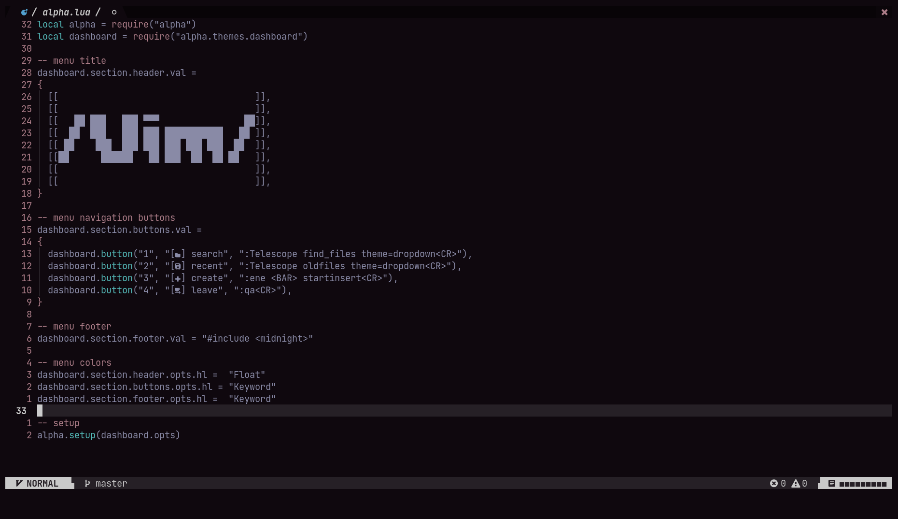
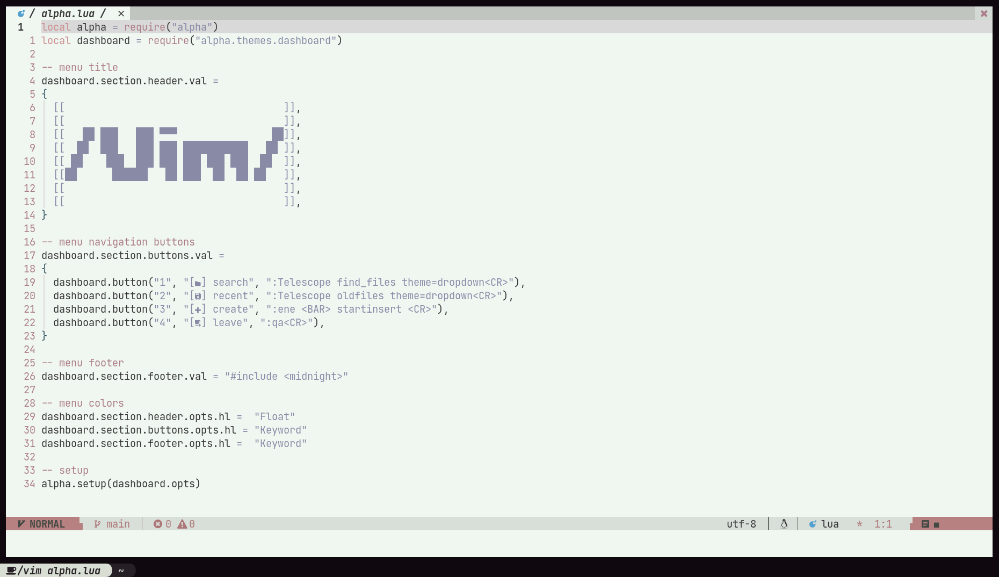

# Starry_Night.Nvim

## [🗒] about
- simple colorscheme designed for starry.nvim

## [⚙️] features

## [📦] installation
```lua
-- Lua packer
use { 'TheMidnightShow/starry_night.nvim' }
```

## [🖥] usage
```lua
-- dark theme
vim.cmd('colorscheme starry_nebula')

-- light theme
vim.cmd('colorscheme starry_nova')
```

## [📺] preview

### starry_nebula


### starry_nova

