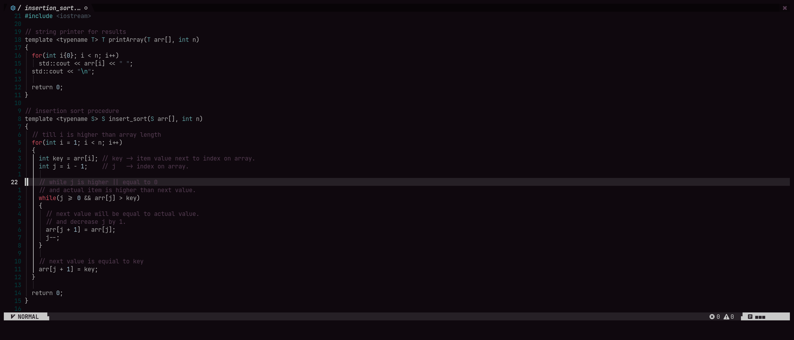
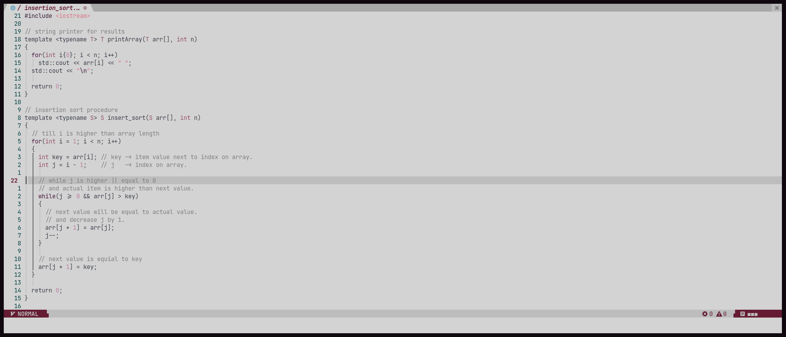

# Starry_Night.Nvim

## [🗒] about
- cozy low contrast colorscheme for neovim mainly designed for the starry.nvim project

## [⚙️] features
- dark & light theme
- low contrast
- pluggin support

## [🔌] support
- [toggleterm](https://github.com/akinsho/toggleterm.nvim)
- [telescope](https://github.com/nvim-telescope/telescope.nvim)
- [nvim-tree](https://github.com/nvim-tree/nvim-tree.lua)
- [lualine](https://github.com/nvim-lualine/lualine.nvim)
- [alpha](https://github.com/goolord/alpha-nvim)
- [cmp](https://github.com/knubie/nvim-cmp)

## [📦] installation
```lua
-- Lua packer
use { 'TheMidnightShow/starry_night.nvim' }
```

## [🖥] usage
```lua
-- dark theme
vim.cmd[[ colorscheme starry_nebula ]]

-- light theme
vim.cmd[[ colorscheme starry_nova ]]
```

## [📺] preview

### starry_nebula


### starry_nova


